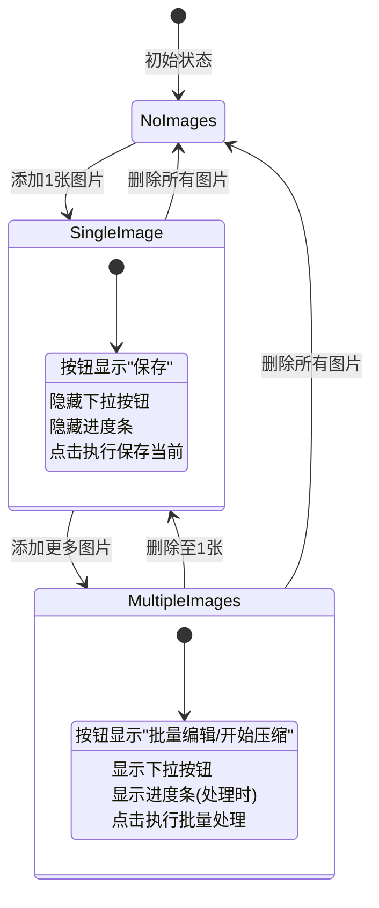

# 设计文档: 按钮文案和交互调整

## 概述

本设计文档描述了图片编辑器和图片压缩器中按钮文案和交互逻辑的调整实现方案。核心思路是根据图片列表数量动态切换按钮的显示文案和行为，当只有单张图片时提供简化的保存流程，隐藏下拉按钮和进度条。

## 架构

### 组件层级

```
Editor Page / Compressor Page
├── Action Button Group
│   ├── Main Action Button (动态文案)
│   └── Dropdown Button (条件显示)
├── Progress Bar (条件显示)
└── Image List (数量决定按钮行为)
```

### 状态流转



## 组件和接口

### 1. Editor Page 按钮组件修改

**文件**: `frontend/src/pages/editor/index.tsx`

**修改点**:
- 将 "开始编辑" 文案改为 "批量编辑"
- 添加图片数量判断逻辑
- 根据数量动态切换按钮文案和行为
- 条件渲染下拉按钮
- 条件渲染进度条

```typescript
// 判断是否为单图模式
const isSingleImageMode = imageFiles.length < 2;

// 按钮文案
const actionButtonText = isSingleImageMode ? '保存' : '批量编辑';

// 按钮点击处理
const handleActionButtonClick = isSingleImageMode 
  ? handleSaveCurrent 
  : handleStartEditing;

// 进度条显示条件
const showProgressBar = !isSingleImageMode && isProcessing;
```

### 2. Compressor Page 按钮组件修改

**文件**: `frontend/src/pages/compressor/index.tsx`

**修改点**:
- 添加图片数量判断逻辑
- 根据数量动态切换按钮文案和行为
- 条件渲染下拉按钮
- 条件渲染进度条

```typescript
// 判断是否为单图模式
const isSingleImageMode = imageFiles.length < 2;

// 按钮文案
const actionButtonText = isSingleImageMode ? '保存' : '开始压缩';

// 按钮点击处理
const handleActionButtonClick = isSingleImageMode 
  ? handleSaveCurrent 
  : handleStartCompression;

// 进度条显示条件
const showProgressBar = !isSingleImageMode && isProcessing;
```

### 3. 保存当前功能

**现有实现**: `handleSaveCurrent` 函数

**行为确认**:
- 不检查 `batchSavePath` 是否配置
- 直接打开文件保存对话框
- 应用当前设置后保存

当前实现已符合需求，无需修改保存逻辑本身。

## 数据模型

本次修改不涉及数据模型变更，仅涉及 UI 逻辑调整。

现有相关状态:
- `imageFiles: ImageFile[]` - 图片列表
- `currentPreview` - 当前预览数据
- `settings` - 编辑/压缩设置
- `isProcessing` - 是否正在处理中
- `progress` - 处理进度

## 正确性属性

*属性是指在系统所有有效执行中都应保持为真的特征或行为——本质上是关于系统应该做什么的形式化陈述。属性是人类可读规范和机器可验证正确性保证之间的桥梁。*

### 属性 1: 编辑页面按钮文案基于图片数量

*对于任意* 编辑页面的图片列表状态，如果列表包含少于2张图片，主操作按钮 SHALL 显示"保存"；否则 SHALL 显示"批量编辑"。

**验证: 需求 1.1, 2.1, 2.5**

### 属性 2: 压缩页面按钮文案基于图片数量

*对于任意* 压缩页面的图片列表状态，如果列表包含少于2张图片，主操作按钮 SHALL 显示"保存"；否则 SHALL 显示"开始压缩"。

**验证: 需求 3.1, 3.5**

### 属性 3: 下拉按钮可见性基于图片数量

*对于任意* 编辑页面和压缩页面的图片列表状态，下拉按钮 SHALL 仅当图片列表包含2张或更多图片时可见。

**验证: 需求 2.2, 2.6, 3.2, 3.6**

### 属性 4: 进度条可见性基于图片数量

*对于任意* 编辑页面和压缩页面的图片列表状态，进度条 SHALL 仅当图片列表包含2张或更多图片时显示。

**验证: 需求 2.3, 3.3**

### 属性 5: 操作按钮处理逻辑基于图片数量

*对于任意* 图片列表状态，点击主操作按钮 SHALL 在列表包含少于2张图片时执行 Save_Current 逻辑，否则 SHALL 执行批量处理逻辑（编辑页面为 Batch_Edit，压缩页面为 Batch_Compress）。

**验证: 需求 2.4, 3.4**

## 错误处理

本次修改不涉及新的错误处理逻辑。现有的 `handleSaveCurrent` 函数已包含完整的错误处理：
- 无数据时显示提示 (`notifyNoDataToSave`)
- 对话框取消时静默返回 (`isDialogCancelled`)
- 保存失败时显示错误 (`handleSaveError`)

## 测试策略

### 单元测试

由于本次修改主要是 UI 逻辑调整，建议通过以下方式验证：

1. **手动测试**：
   - 编辑页面添加1张图片，验证按钮显示"保存"且无下拉按钮和进度条
   - 编辑页面添加2张图片，验证按钮显示"批量编辑"且有下拉按钮
   - 压缩页面添加1张图片，验证按钮显示"保存"且无下拉按钮和进度条
   - 压缩页面添加2张图片，验证按钮显示"开始压缩"且有下拉按钮

2. **功能测试**：
   - 单图模式点击"保存"按钮，验证弹出文件保存对话框，无进度条显示
   - 多图模式点击"批量编辑/开始压缩"按钮，验证执行批量处理并显示进度条

### 基于属性的测试

本次修改为纯 UI 逻辑调整，不涉及复杂的数据处理，因此不需要基于属性的测试。核心逻辑是简单的条件判断 (`imageFiles.length < 2`)，通过代码审查和手动测试即可验证。
